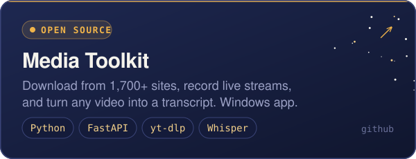
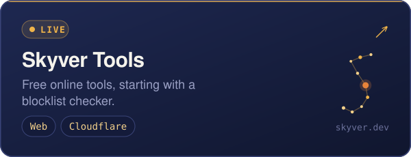
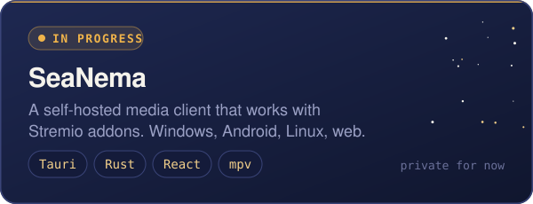
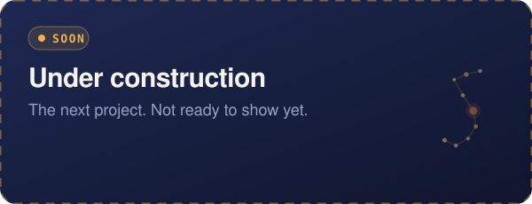

## Stack

<table align="center">
  <tr>
    <td align="center" valign="top" width="33%"><b>Infrastructure</b>  </td>
    <td align="center" valign="top" width="33%"><b>Web &amp; back end</b>  </td>
    <td align="center" valign="top" width="33%"><b>Desktop &amp; data</b>  </td>
  </tr>
</table>

## Projects

  
  
   
  
  

 

