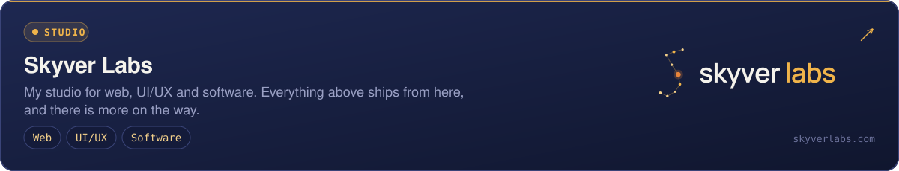

  
  
  

## 🛰️ About me

- 🐧 **Linux engineer.** I set up and look after the servers my projects run on: Docker, nginx and Cloudflare in front, on machines I manage myself.
- 🧪 **Building [Skyver Labs](https://skyverlabs.com)**, a small studio for web, UI/UX and software.
- 🎬 **Latest release:** [Media Toolkit v1.2.0](https://github.com/AnotherAH/media-toolkit/releases), an open-source Windows app for downloading, recording and transcribing video.
- 🏠 Most of my other work is self-hosted and still private. More of it will show up here.

## 🧰 Tools I work with

<table align="center">
  <tr>
    <td align="center" valign="top" width="33%"><b>Infrastructure</b>  </td>
    <td align="center" valign="top" width="33%"><b>Web &amp; back end</b>  </td>
    <td align="center" valign="top" width="33%"><b>Desktop &amp; more</b>  </td>
  </tr>
</table>

## 🚀 Things I'm building

  
  
   
  

 

